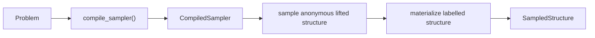

# Architecture

## Repository layout

```text
src/c2_wms/
├── sampler.py             public API plus compile/sample orchestration
├── _wfomc_adapter.py      pinned WFOMC compilation policy and validation
├── arithmetic.py          sparse exact FLINT coefficient access
├── discrete_sampling.py   arbitrary-precision exact alias sampling
├── trace/
│   ├── kernel.py          trace-producing incremental3 recurrence
│   └── traceback.py       lazy degree-conditioned DP traceback
├── pair_sampling.py       direct/SAT/SDD local pair sampling
├── label_sampling.py      unary-evidence-aware domain-label sampling
├── projection.py          removal of reduction-only predicates
└── structure.py           immutable public sampled structure
```

## Compilation and sampling flow



`CompiledSampler` directly owns the root/degree mixture, incremental3
traceback samplers, pair samplers, and label-allocation caches. There is no
intermediate plan object. Internally, anonymous sampling combines the exact
root draw with incremental3 traceback and returns one `AnonymousSample`. That
small record contains the chosen component trace, cell configuration, the cell
of each anonymous element, and its pair requests. Materialization then combines
conditioned pair sampling, evidence-aware domain-label sampling, and
source-vocabulary projection.

The implementation reuses WFOMC's C2 normalizer, reductions, cell graph,
counting automata, arithmetic contexts, configuration space, and elimination
orders. The sampler-specific code adds compact values needed for backward
sampling; it does not fork the parser or logical reduction pipeline.

The WFOMC adapter always requests `WeightOptions(precision="exact")`. There is
no rounded-arithmetic branch in the sampler, and `SamplerOptions` intentionally
does not contain a precision setting.

## General C2 handling

WFOMC normalizes an arbitrary embedded count body to a fresh projected binary
predicate plus a quantifier-free definition. The incremental3 counting state
therefore tracks one or more finite row-counter automata independent of whether
the original body was atomic, negated, conjunctive, disjunctive, or nested in a
larger Boolean formula. `c2-wms` traces those general transition tables rather
than matching a special formula shape.

During output reconstruction, the pair sampler first checks whether the
projected mask fixes every binary predicate. In that common case it restores
the true atoms directly and never constructs pair CNF. General formulas ground
the reduced QF theory in both orientations only when first needed, then
enumerate the endpoint-cell/mask-conditioned assignments with PySAT. If more
than 128 assignments survive, a condition-specific SDD is compiled lazily.
This restores models of arbitrary counting bodies while keeping local work
independent of domain size and avoiding a global pair-SDD startup cost.

## Exactness invariants

- Accepted root coefficients are filtered by the original cardinality
  constraints, using the same internal marker names as WFOMC.
- The root mixture is built from the exact traced recurrence; regression tests
  compare it with WFOMC's exact result without re-running `solve()` in the
  production compilation path. For `LEQ`, the constant `n!` order factor
  omitted by the relative DP basis is restored.
- Every direct result or lazily built `(left cell, right cell, projected mask)`
  distribution is checked against WFOMC's materialized pair factor by default.
- All alias thresholds are integer. FLINT polynomial coefficient budgets are
  split exactly at every product node.
- Unary-evidence profiles are allocated to compatible cells with their exact
  multinomial mass before concrete constants are bound.
- Only predicates declared by the source problem survive projection.

`SamplerOptions(validate_masses=False)` can disable the repeated pair-factor
guard after a deployment has validated its exact pinned dependency, but it does
not change the sampling algorithm.

## Performance model

Let `n` be the domain size and hold the C2 theory fixed.

- WFOMC compilation and trace construction are paid once.
- Each warm trace visits one interaction for every unordered pair: `O(n²)`.
- Direct pair reconstruction is linear in the fixed binary vocabulary. General
  pair distributions have theory-dependent SAT/SDD cost and reuse conditioned
  coefficient aliases.
- Cache cardinality is bounded by compiled DP states and local
  `cell-pair × projected-mask × degree` conditions, not by sample count.
- One sample stores its labels, pair requests, and true binary tuples; it does
  not retain previous samples.

The worst-case `O(n²)` sample cost is output-optimal because an explicit binary
structure itself can contain `n²` true tuples.
